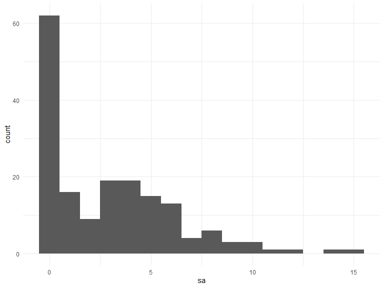
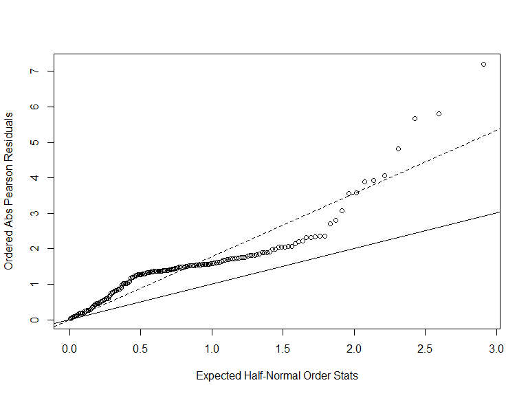

p8131\_hw5\_jsg2145
================
Jared Garfinkel
3/7/2020

## Problem 1

``` r
crab_df = read_table2("./data/HW5-crab.txt") %>% 
  janitor::clean_names()
```

    ## Parsed with column specification:
    ## cols(
    ##   number = col_double(),
    ##   C = col_double(),
    ##   S = col_double(),
    ##   W = col_double(),
    ##   Wt = col_double(),
    ##   Sa = col_double()
    ## )

This dataset is 173 by 6. It gives information about female crabs like
the average weight is 2.44. Other variables like carapace width, color,
and the condition of the spine. The response variable is the number of
satellite male crabs around one’s nest.

``` r
crab_df %>% 
  ggplot(aes(x = sa)) +
  geom_histogram(binwidth = 1)
```



``` r
M1 <- glm(sa ~ w, family = poisson(link = log), 
                 data = crab_df)
summary(M1)
```

    ## 
    ## Call:
    ## glm(formula = sa ~ w, family = poisson(link = log), data = crab_df)
    ## 
    ## Deviance Residuals: 
    ##     Min       1Q   Median       3Q      Max  
    ## -2.8526  -1.9884  -0.4933   1.0970   4.9221  
    ## 
    ## Coefficients:
    ##             Estimate Std. Error z value Pr(>|z|)    
    ## (Intercept) -3.30476    0.54224  -6.095  1.1e-09 ***
    ## w            0.16405    0.01997   8.216  < 2e-16 ***
    ## ---
    ## Signif. codes:  0 '***' 0.001 '**' 0.01 '*' 0.05 '.' 0.1 ' ' 1
    ## 
    ## (Dispersion parameter for poisson family taken to be 1)
    ## 
    ##     Null deviance: 632.79  on 172  degrees of freedom
    ## Residual deviance: 567.88  on 171  degrees of freedom
    ## AIC: 927.18
    ## 
    ## Number of Fisher Scoring iterations: 6

The rate ratio of the number of satellite males around one’s nest is
1.18. This indicates that the number of satellites increases as the
width of the female increases. Next, we check for over-dispersion.

``` r
res.p1 = residuals(M1, type = "pearson", data = crab_df)
G1 = sum(res.p1^2)
pval = 1 - pchisq(G1, df = 170) # low p-value indicates a lack of fit
phi1 = G1 / (170)
phi1
```

    ## [1] 3.200924

``` r
M1$deviance/M1$df.residual
```

    ## [1] 3.320927

``` r
plot(qnorm((173+1:173+0.5)/(2*173+1.125)),
     sort(abs(res.p1)), 
     xlab = 'Expected Half-Normal Order Stats',
     ylab='Ordered Abs Pearson Residuals')
abline(a=0, b=1)
abline(a=0, b=sqrt(phi1), lty=2)
```



There appears to be overdispersion indicating the data may not follow
the theoretical distribution.

``` r
M2 <- glm(sa ~ w + wt, 
          family = poisson(link = log), 
          data = crab_df)
summary(M2)
```

    ## 
    ## Call:
    ## glm(formula = sa ~ w + wt, family = poisson(link = log), data = crab_df)
    ## 
    ## Deviance Residuals: 
    ##     Min       1Q   Median       3Q      Max  
    ## -2.9308  -1.9705  -0.5481   0.9700   4.9905  
    ## 
    ## Coefficients:
    ##             Estimate Std. Error z value Pr(>|z|)   
    ## (Intercept) -1.29168    0.89929  -1.436  0.15091   
    ## w            0.04590    0.04677   0.981  0.32640   
    ## wt           0.44744    0.15864   2.820  0.00479 **
    ## ---
    ## Signif. codes:  0 '***' 0.001 '**' 0.01 '*' 0.05 '.' 0.1 ' ' 1
    ## 
    ## (Dispersion parameter for poisson family taken to be 1)
    ## 
    ##     Null deviance: 632.79  on 172  degrees of freedom
    ## Residual deviance: 559.89  on 170  degrees of freedom
    ## AIC: 921.18
    ## 
    ## Number of Fisher Scoring iterations: 6

A second model is proposed including the width of the carapace and the
weight of the females. In this model, the rate ratio is 1.05 with each
unit increase in width holding the weight constant. The rate ratio for
male satellites is 1.56 for each unit increase in weight holding width
constant.

``` r
res.p2 = residuals(M2, type = "pearson", data = crab_df)
G2 = sum(res.p2^2)
pval = 1 - pchisq(G2, df = 170)
phi2 = G2 / (170)
phi2
```

    ## [1] 3.156449

``` r
M2$deviance/M2$df.residual
```

    ## [1] 3.293442

``` r
summary(M2,
        dispersion = phi2)
```

    ## 
    ## Call:
    ## glm(formula = sa ~ w + wt, family = poisson(link = log), data = crab_df)
    ## 
    ## Deviance Residuals: 
    ##     Min       1Q   Median       3Q      Max  
    ## -2.9308  -1.9705  -0.5481   0.9700   4.9905  
    ## 
    ## Coefficients:
    ##             Estimate Std. Error z value Pr(>|z|)
    ## (Intercept) -1.29168    1.59771  -0.808    0.419
    ## w            0.04590    0.08309   0.552    0.581
    ## wt           0.44744    0.28184   1.588    0.112
    ## 
    ## (Dispersion parameter for poisson family taken to be 3.156449)
    ## 
    ##     Null deviance: 632.79  on 172  degrees of freedom
    ## Residual deviance: 559.89  on 170  degrees of freedom
    ## AIC: 921.18
    ## 
    ## Number of Fisher Scoring iterations: 6

``` r
plot(qnorm((173+1:173+0.5)/(2*173+1.125)),
     sort(abs(res.p2)), 
     xlab = 'Expected Half-Normal Order Stats',
     ylab='Ordered Abs Pearson Residuals')
abline(a=0, b=1)
abline(a=0, b=sqrt(phi2), lty=2)
```


This model also appears to show overdispersion. After adjusting for
overdispersion, it appears the predictors become insignificant in the
model. This indicates that the variance of the predictors may be due to
something else, not association with the response variable.

``` r
test.stat = M1$deviance - M2$deviance # deviance (from original model fitting)
df = 171 - 170
res.p = residuals(M2, type = "pearson")  
res.p 
```

    ##           1           2           3           4           5           6 
    ##  2.04319095  0.64534985 -1.52599847 -1.28398441 -1.49422552  0.37090999 
    ##           7           8           9          10          11          12 
    ## -1.27922978 -1.48497616  3.92992264  1.01589131  1.01556263  0.19747960 
    ##          13          14          15          16          17          18 
    ## -1.07516295  1.88568574  0.27509594  1.98129251  1.81003944  0.19741617 
    ##          19          20          21          22          23          24 
    ##  2.30917732  1.02165940 -1.88521235  0.25017544 -1.33010442 -2.07237368 
    ##          25          26          27          28          29          30 
    ## -0.82806803 -0.55563033 -1.34369497  0.87190683 -0.14465226 -1.18796772 
    ##          31          32          33          34          35          36 
    ## -1.26780757 -1.57084989  2.31074055  4.81106397  1.31248096 -0.86629833 
    ##          37          38          39          40          41          42 
    ##  3.88655479  2.36637827 -1.26825475  0.08501654  0.30660570 -1.55026305 
    ##          43          44          45          46          47          48 
    ## -0.24146485 -1.62913080 -1.24268733 -1.44795873 -1.48114464  7.19786661 
    ##          49          50          51          52          53          54 
    ## -1.51161815 -0.46090951 -0.58542235 -0.19734753  1.05505114 -1.37194798 
    ##          55          56          57          58          59          60 
    ##  1.73289789  1.55797690  1.90437105  1.90156558 -1.83559283  0.09497409 
    ##          61          62          63          64          65          66 
    ##  2.70558673  2.20149369 -1.39736851 -1.23665711 -1.28842100 -1.99480673 
    ##          67          68          69          70          71          72 
    ## -0.41355012 -1.25991676 -0.84010995 -1.16958108 -1.03012347 -0.59145775 
    ##          73          74          75          76          77          78 
    ## -1.42506673  1.54956541 -1.57157546 -0.60053882  2.79404131  1.59023683 
    ##          79          80          81          82          83          84 
    ##  2.35899143 -0.42936642 -0.89926800  0.27220046 -1.40702217 -1.35396786 
    ##          85          86          87          88          89          90 
    ##  2.05699911 -1.36332169 -1.79117885  4.05840383 -1.41349497 -1.71445914 
    ##          91          92          93          94          95          96 
    ##  2.34605012  0.98137013 -0.57521350  1.04450906 -1.69538825 -1.36605965 
    ##          97          98          99         100         101         102 
    ##  1.36442416  0.10653092  1.19908342  0.74619083  5.67550765 -1.55694538 
    ##         103         104         105         106         107         108 
    ##  1.70653248 -1.63615309 -0.50754055 -1.26825475  1.85983112  0.70003062 
    ##         109         110         111         112         113         114 
    ## -1.74121778 -1.71544908 -1.38398011 -1.46567669  0.81213971 -1.55045618 
    ##         115         116         117         118         119         120 
    ##  1.81660225 -1.35086419  1.81660225  0.19223247  2.05631373 -1.39497036 
    ##         121         122         123         124         125         126 
    ## -1.51857213  1.60612603 -1.43226559 -0.05455160 -1.59995583  1.36899191 
    ##         127         128         129         130         131         132 
    ## -0.51302322 -1.52950451 -0.26717044 -1.75446178 -1.48157219 -1.39696526 
    ##         133         134         135         136         137         138 
    ##  3.57129387 -0.77823355  1.51536705  0.54127986 -1.76283818 -1.47902953 
    ##         139         140         141         142         143         144 
    ## -1.75425925 -0.44977886  2.22820618 -0.45179533  1.53736178 -0.11470365 
    ##         145         146         147         148         149         150 
    ## -1.72730019 -1.32852398 -1.28806729 -1.32933686  0.36889902 -1.52162187 
    ##         151         152         153         154         155         156 
    ## -1.58533606 -1.37510008 -1.67365225 -1.55694538 -1.37742082 -0.77823355 
    ##         157         158         159         160         161         162 
    ## -0.03750934 -1.51249096  3.55781807  3.07745197 -0.28590212 -0.17196504 
    ##         163         164         165         166         167         168 
    ##  0.19060086  0.47170029 -1.68525241 -1.62120256  5.79826041 -1.39336083 
    ##         169         170         171         172         173 
    ## -2.05343715  0.82616622  2.14732731 -0.06598824 -1.43885452

``` r
G = sum(res.p^2) # calc dispersion param based on larger model
phi = G / 170
F.stat = test.stat / (df * phi)
pval = 1 - pf(F.stat, df, 170)
pval
```

    ## [1] 0.1133882

A p-value above 0.05 (p = 0.113) means we do not reject the null, and
therefore we accept the smaller model.

## Problem 2
