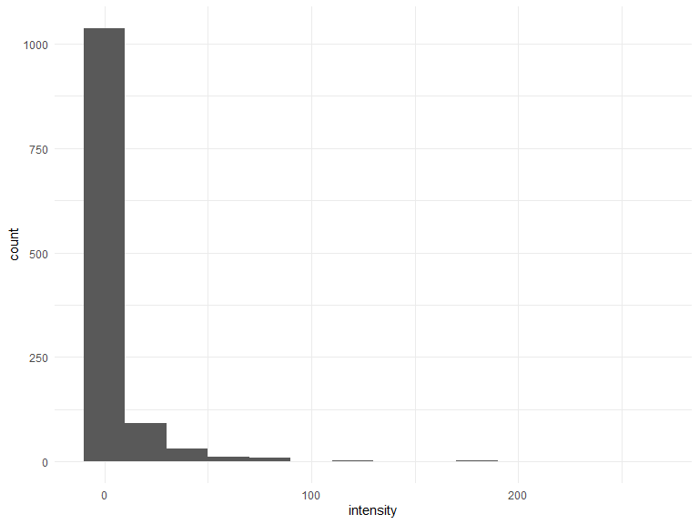
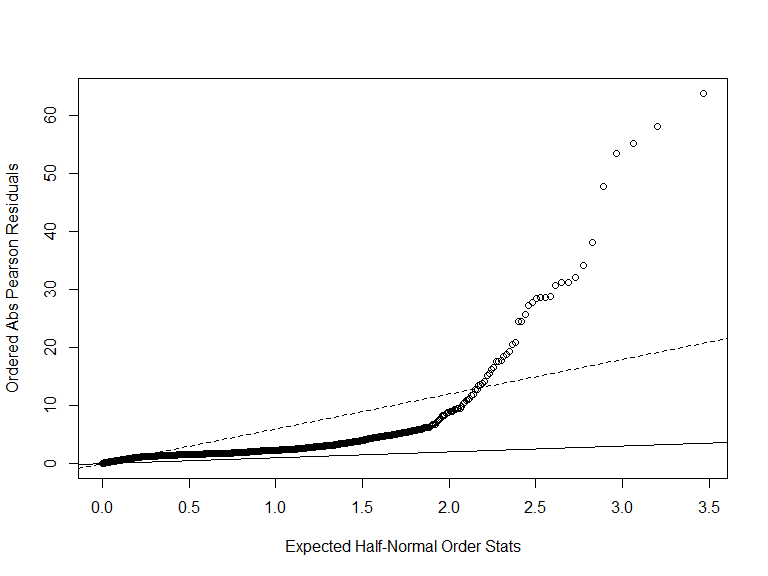

p8131\_hw5\_jsg2145
================
Jared Garfinkel
3/7/2020

## Problem 1

``` r
crab_df = read_table2("./data/HW5-crab.txt") %>% 
  janitor::clean_names()
```

    ## Parsed with column specification:
    ## cols(
    ##   number = col_double(),
    ##   C = col_double(),
    ##   S = col_double(),
    ##   W = col_double(),
    ##   Wt = col_double(),
    ##   Sa = col_double()
    ## )

This dataset is 173 by 6. It gives information about female crabs like
the average weight is 2.44. Other variables like carapace width, color,
and the condition of the spine. The response variable is the number of
satellite male crabs around one’s nest.

``` r
crab_df %>% 
  ggplot(aes(x = sa)) +
  geom_histogram(binwidth = 1)
```


``` r
M1 <- glm(sa ~ w, family = poisson(link = log), 
                 data = crab_df)
summary(M1)
```

    ## 
    ## Call:
    ## glm(formula = sa ~ w, family = poisson(link = log), data = crab_df)
    ## 
    ## Deviance Residuals: 
    ##     Min       1Q   Median       3Q      Max  
    ## -2.8526  -1.9884  -0.4933   1.0970   4.9221  
    ## 
    ## Coefficients:
    ##             Estimate Std. Error z value Pr(>|z|)    
    ## (Intercept) -3.30476    0.54224  -6.095  1.1e-09 ***
    ## w            0.16405    0.01997   8.216  < 2e-16 ***
    ## ---
    ## Signif. codes:  0 '***' 0.001 '**' 0.01 '*' 0.05 '.' 0.1 ' ' 1
    ## 
    ## (Dispersion parameter for poisson family taken to be 1)
    ## 
    ##     Null deviance: 632.79  on 172  degrees of freedom
    ## Residual deviance: 567.88  on 171  degrees of freedom
    ## AIC: 927.18
    ## 
    ## Number of Fisher Scoring iterations: 6

The rate ratio of the number of satellite males around one’s nest is
1.18. This indicates that the number of satellites increases as the
width of the female increases. Next, we check for over-dispersion.

``` r
res.p1 = residuals(M1, type = "pearson", data = crab_df)
G1 = sum(res.p1^2)
pval = 1 - pchisq(G1, df = 170) # low p-value indicates a lack of fit
phi1 = G1 / (170)
phi1
```

    ## [1] 3.200924

``` r
M1$deviance/M1$df.residual
```

    ## [1] 3.320927

``` r
plot(qnorm((173+1:173+0.5)/(2*173+1.125)),
     sort(abs(res.p1)), 
     xlab = 'Expected Half-Normal Order Stats',
     ylab='Ordered Abs Pearson Residuals')
abline(a=0, b=1)
abline(a=0, b=sqrt(phi1), lty=2)
```


There appears to be overdispersion indicating the data may not follow
the theoretical distribution.

``` r
M2 <- glm(sa ~ w + wt, 
          family = poisson(link = log), 
          data = crab_df)
summary(M2)
```

    ## 
    ## Call:
    ## glm(formula = sa ~ w + wt, family = poisson(link = log), data = crab_df)
    ## 
    ## Deviance Residuals: 
    ##     Min       1Q   Median       3Q      Max  
    ## -2.9308  -1.9705  -0.5481   0.9700   4.9905  
    ## 
    ## Coefficients:
    ##             Estimate Std. Error z value Pr(>|z|)   
    ## (Intercept) -1.29168    0.89929  -1.436  0.15091   
    ## w            0.04590    0.04677   0.981  0.32640   
    ## wt           0.44744    0.15864   2.820  0.00479 **
    ## ---
    ## Signif. codes:  0 '***' 0.001 '**' 0.01 '*' 0.05 '.' 0.1 ' ' 1
    ## 
    ## (Dispersion parameter for poisson family taken to be 1)
    ## 
    ##     Null deviance: 632.79  on 172  degrees of freedom
    ## Residual deviance: 559.89  on 170  degrees of freedom
    ## AIC: 921.18
    ## 
    ## Number of Fisher Scoring iterations: 6

A second model is proposed including the width of the carapace and the
weight of the females. In this model, the rate ratio is 1.05 with each
unit increase in width holding the weight constant. The rate ratio for
male satellites is 1.56 for each unit increase in weight holding width
constant.

``` r
res.p2 = residuals(M2, type = "pearson", data = crab_df)
G2 = sum(res.p2^2)
pval = 1 - pchisq(G2, df = 170)
phi2 = G2 / (170)
phi2
```

    ## [1] 3.156449

``` r
M2$deviance/M2$df.residual
```

    ## [1] 3.293442

``` r
summary(M2,
        dispersion = phi2)
```

    ## 
    ## Call:
    ## glm(formula = sa ~ w + wt, family = poisson(link = log), data = crab_df)
    ## 
    ## Deviance Residuals: 
    ##     Min       1Q   Median       3Q      Max  
    ## -2.9308  -1.9705  -0.5481   0.9700   4.9905  
    ## 
    ## Coefficients:
    ##             Estimate Std. Error z value Pr(>|z|)
    ## (Intercept) -1.29168    1.59771  -0.808    0.419
    ## w            0.04590    0.08309   0.552    0.581
    ## wt           0.44744    0.28184   1.588    0.112
    ## 
    ## (Dispersion parameter for poisson family taken to be 3.156449)
    ## 
    ##     Null deviance: 632.79  on 172  degrees of freedom
    ## Residual deviance: 559.89  on 170  degrees of freedom
    ## AIC: 921.18
    ## 
    ## Number of Fisher Scoring iterations: 6

``` r
plot(qnorm((173+1:173+0.5)/(2*173+1.125)),
     sort(abs(res.p2)), 
     xlab = 'Expected Half-Normal Order Stats',
     ylab='Ordered Abs Pearson Residuals')
abline(a=0, b=1)
abline(a=0, b=sqrt(phi2), lty=2)
```


This model also appears to show overdispersion. After adjusting for
overdispersion, it appears the predictors become insignificant in the
model. This indicates that the variance of the predictors may be due to
something else, not association with the response variable.

``` r
test.stat = M1$deviance - M2$deviance # deviance (from original model fitting)
df = 171 - 170
res.p = residuals(M2, type = "pearson")  
res.p 
G = sum(res.p^2) # calc dispersion param based on larger model
phi = G / 170
F.stat = test.stat / (df * phi)
pval.test1 = 1 - pf(F.stat, df, 170)
pval.test1 # .113
```

A p-value above 0.05 (p = 0) means we do not reject the null, and
therefore we accept the smaller model.

## Problem 2

``` r
para_df = read_table2("./data/HW5-parasite.txt") %>% 
  janitor::clean_names() %>% 
  drop_na(c(length, intensity)) %>%
  select(sample, intensity, year, length, area) %>% 
  mutate(year = factor(year),
         area = factor(area))
```

    ## Parsed with column specification:
    ## cols(
    ##   Sample = col_double(),
    ##   Intensity = col_double(),
    ##   omit = col_double(),
    ##   Year = col_double(),
    ##   omit_1 = col_double(),
    ##   omit_2 = col_double(),
    ##   Length = col_double(),
    ##   omit_3 = col_double(),
    ##   omit_4 = col_double(),
    ##   omit_5 = col_double(),
    ##   Area = col_double()
    ## )

After removing missing values in the variables of interest, this
dataframe is 1191 by 5. It includes information about where the fish
were caught (area), the sizes of the fish (length), and the year in
which the fish were caught. The response variable is the intensity of
parasites in each fish, which occur as follows:

``` r
para_df %>% 
  ggplot(aes(x = intensity)) +
  geom_histogram(binwidth = 20)
```



``` r
skimr::skim(para_df)

para_df %>% 
  distinct(year)
```

``` r
para.pois = glm(intensity ~ area + length + year, family = poisson(link = log), data = para_df)

summary(para.pois)
```

    ## 
    ## Call:
    ## glm(formula = intensity ~ area + length + year, family = poisson(link = log), 
    ##     data = para_df)
    ## 
    ## Deviance Residuals: 
    ##     Min       1Q   Median       3Q      Max  
    ## -9.3632  -2.7158  -2.0142  -0.4731  30.2492  
    ## 
    ## Coefficients:
    ##               Estimate Std. Error z value Pr(>|z|)    
    ## (Intercept)  2.6431709  0.0542838  48.692  < 2e-16 ***
    ## area2       -0.2119557  0.0491691  -4.311 1.63e-05 ***
    ## area3       -0.1168602  0.0428296  -2.728  0.00636 ** 
    ## area4        1.4049366  0.0356625  39.395  < 2e-16 ***
    ## length      -0.0284228  0.0008809 -32.265  < 2e-16 ***
    ## year2000     0.6702801  0.0279823  23.954  < 2e-16 ***
    ## year2001    -0.2181393  0.0287535  -7.587 3.29e-14 ***
    ## ---
    ## Signif. codes:  0 '***' 0.001 '**' 0.01 '*' 0.05 '.' 0.1 ' ' 1
    ## 
    ## (Dispersion parameter for poisson family taken to be 1)
    ## 
    ##     Null deviance: 25797  on 1190  degrees of freedom
    ## Residual deviance: 19153  on 1184  degrees of freedom
    ## AIC: 21089
    ## 
    ## Number of Fisher Scoring iterations: 7

This model shows that the rate ratio of the intensity of parasites is
0.809 in area 2 compared to area 1 holding length and year constant.

The rate ratio of the intensity of parasites is 0.89 in area 3 compared
to area 1 holding length and year constant.

The rate ratio of the intensity of parasites is 4.075 in area 4 compared
to area 1 holding length and year constant.

The rate ratio of the intensity of parasites is 0.972 for each unit
increase in length holding area and year constant.

The rate ratio of the intensity of parasites is 1.955 in the year 2000
compared to 1999 holding area and length constant.

The rate ratio of the intensity of parasites is 0.804 in the year 2001
compared to 1999 holding area and length constant.

So, area 4 is much more likely to have fish with higher intensity
parasites, while larger fish are more likely to have lower intensity of
parasites.

``` r
res.para = residuals(para.pois, 
                     type = "pearson",
                     data = para_df)
G.para = sum(res.para^2)
pval = 1 - pchisq(G.para, df = 1184)
phi.para = G.para / (1184)
phi.para
```

    ## [1] 35.61231

``` r
para.pois$deviance / para.pois$df.residual
```

    ## [1] 16.17635

``` r
summary(para.pois, dispersion = phi.para)
```

    ## 
    ## Call:
    ## glm(formula = intensity ~ area + length + year, family = poisson(link = log), 
    ##     data = para_df)
    ## 
    ## Deviance Residuals: 
    ##     Min       1Q   Median       3Q      Max  
    ## -9.3632  -2.7158  -2.0142  -0.4731  30.2492  
    ## 
    ## Coefficients:
    ##              Estimate Std. Error z value Pr(>|z|)    
    ## (Intercept)  2.643171   0.323944   8.159 3.37e-16 ***
    ## area2       -0.211956   0.293422  -0.722    0.470    
    ## area3       -0.116860   0.255590  -0.457    0.648    
    ## area4        1.404937   0.212820   6.602 4.07e-11 ***
    ## length      -0.028423   0.005257  -5.407 6.42e-08 ***
    ## year2000     0.670280   0.166987   4.014 5.97e-05 ***
    ## year2001    -0.218139   0.171590  -1.271    0.204    
    ## ---
    ## Signif. codes:  0 '***' 0.001 '**' 0.01 '*' 0.05 '.' 0.1 ' ' 1
    ## 
    ## (Dispersion parameter for poisson family taken to be 35.61231)
    ## 
    ##     Null deviance: 25797  on 1190  degrees of freedom
    ## Residual deviance: 19153  on 1184  degrees of freedom
    ## AIC: 21089
    ## 
    ## Number of Fisher Scoring iterations: 7

``` r
plot(qnorm((1191 + 1:1191 + 0.5)/(2*1191 + 1.125)),
     sort(abs(res.para)),
     xlab = 'Expected Half-Normal Order Stats',
     ylab = 'Ordered Abs Pearson Residuals')
abline(a=0, b=1)
abline(a=0, b = sqrt(phi.para), lty=2)
```



It appears that the residuals follow a parabolic curve indicating that
there is a mismatch between the model and the observed values.

``` r
para.0 <- zeroinfl(intensity ~ area + year + length, data = para_df)
summary(para.0)
```

    ## 
    ## Call:
    ## zeroinfl(formula = intensity ~ area + year + length, data = para_df)
    ## 
    ## Pearson residuals:
    ##     Min      1Q  Median      3Q     Max 
    ## -2.1278 -0.8265 -0.5829 -0.1821 25.4837 
    ## 
    ## Count model coefficients (poisson with log link):
    ##               Estimate Std. Error z value Pr(>|z|)    
    ## (Intercept)  3.8431714  0.0583793  65.831  < 2e-16 ***
    ## area2        0.2687835  0.0500467   5.371 7.85e-08 ***
    ## area3        0.1463173  0.0439485   3.329 0.000871 ***
    ## area4        0.9448068  0.0368342  25.650  < 2e-16 ***
    ## year2000     0.3919831  0.0282952  13.853  < 2e-16 ***
    ## year2001    -0.0448455  0.0296057  -1.515 0.129833    
    ## length      -0.0368067  0.0009747 -37.762  < 2e-16 ***
    ## 
    ## Zero-inflation model coefficients (binomial with logit link):
    ##              Estimate Std. Error z value Pr(>|z|)    
    ## (Intercept)  0.552585   0.275762   2.004  0.04509 *  
    ## area2        0.718676   0.189552   3.791  0.00015 ***
    ## area3        0.657708   0.167402   3.929 8.53e-05 ***
    ## area4       -1.022868   0.188201  -5.435 5.48e-08 ***
    ## year2000    -0.752119   0.172965  -4.348 1.37e-05 ***
    ## year2001     0.456535   0.143962   3.171  0.00152 ** 
    ## length      -0.009889   0.004629  -2.136  0.03266 *  
    ## ---
    ## Signif. codes:  0 '***' 0.001 '**' 0.01 '*' 0.05 '.' 0.1 ' ' 1 
    ## 
    ## Number of iterations in BFGS optimization: 22 
    ## Log-likelihood: -6950 on 14 Df

This model shows that the rate ratio of the intensity of parasites is
2.052 in area 2 compared to area 1 holding length and year constant.

The rate ratio of the intensity of parasites is 1.93 in area 3 compared
to area 1 holding length and year constant.

The rate ratio of the intensity of parasites is 0.36 in area 4 compared
to area 1 holding length and year constant.

The rate ratio of the intensity of parasites is 0.99 for each unit
increase in length holding area and year constant.

The rate ratio of the intensity of parasites is 0.471 in the year 2000
compared to 1999 holding area and length constant.

The rate ratio of the intensity of parasites is 1.579 in the year 2001
compared to 1999 holding area and length constant.

Fitting a model for zero inflation our parasites model shows that area 4
is associated with lower intensity of parasites, while areas 2 and 3 are
associated with higher intensity. On the other hand, higher length
remains associated with lower intensity of parasites. So, fitting a
model for zero inflation changed the association between area and
intensity.
